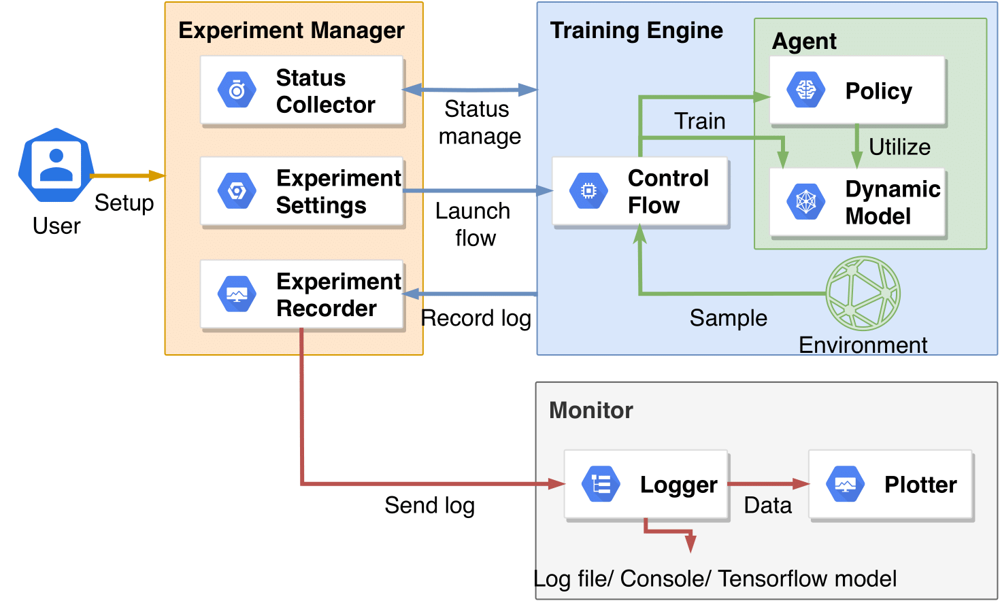
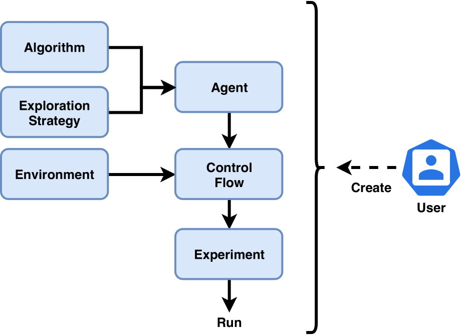

System Overview of Baconian
=========================================

The system overview of Baconian is shown in below figure. We design Baconian with the objective to
minimize users’ coding effort on developing and testing MBRL algorithms. With Baconian, the user can easily setup a
MBRL experiment by configuring the target algorithms and modules without the need for understanding the inner
mechanisms.

    System Overview of Baconian.

Following figure shows the experiment creation flow of Baconian.

    Baconian experiment creation process.

First, the user should create a environment and a RL algorithm module with necessary hyper-parameters configured,
e.g., neural network size, learning rate. Algorithm module is usually composed by a policy module and a dynamics model
module depending on different algorithms. Then, the user needs to create an agent module by passing the algorithm
module, and the exploration strategy module if needed, into it. Second, the user should create a control flow module
that defines how the experiments should be proceeded and the stopping conditions. This includes defining how much
samples should be collected for training at each step, and what condition to indicate the completion of an experiment,
etc. Some typical control flows have already been implemented in Baconian to meet the users' needs.

Finally, an experiment module should be created by passing the agent, environment, control flow modules into it, and
then launched. After that, the Baconian will handle the experiment running, monitoring, and results saving/logging, etc.

For more information on system design of Baconian, you can read our demo paper at: https://arxiv.org/abs/1904.10762.