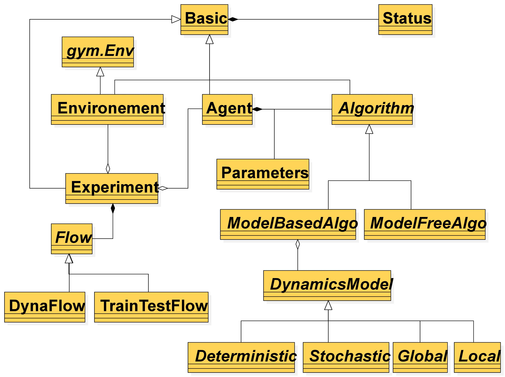

System Overview of Baconian
=========================================

The system overview of Baconian is shown in below figure. We design Baconian with the objective to
minimize users’ coding effort on developing and testing MBRL algorithms. With Baconian, the user can easily setup a
MBRL experiment by configuring the target algorithms and modules without the need for understanding the inner
mechanisms.

    System Overview of Baconian.

Baconian follows the Object-Oriented Design (OOD) and applies design patterns including strategy method, observer
method, singleton method, and decorator method to build a flexible and reusable framework. The simplified system
implementation diagram is shown in below figure.

    Simplified system UML diagram

For more information on system design of Baconian, you can read our demo paper at: https://arxiv.org/abs/1904.10762.