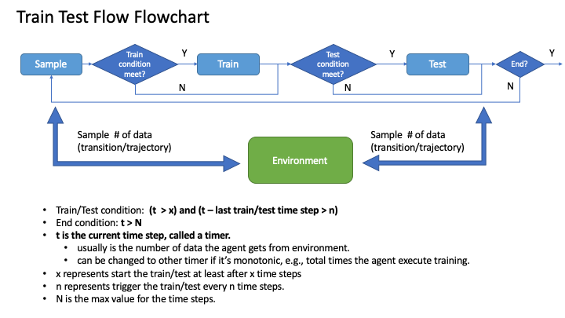

Best practice and core concepts of Baconian
===========================================================================

Here we introduce the core ideas and features about Baconian, to make sure you utilize the code correctly. As
for the detailed usage of different algorithms, dynamics, please refer to the :doc:`API <API>` page

Put your task into a function
------------------------------
Here we introduce the basic usage of Baconian, and introduce how it can help you
to set up the model-based RL experiments.

First of all, whenever you want to run some algorithms, or any codes within the
baconian, simply you need to wrap your code into a function, and pass this
function to ``single_exp_runner`` or ``duplicate_exp_runner``. In this method, Baconian will do some internal initialization of logging, experiment
set-up etc.

``single_exp_runner`` will run your function for once. As for ``duplicate_exp_runner``, it is designed for running
multiple experiments in a row, because in RL experiments, we usually run the experiment with a certain set of parameters but with different seeds to get a more
stable results. So use ``duplicate_exp_runner`` can easily help you to achieve this, and the log file
will be stored into sub-directory under your home log directory respectively.

Specifically, you can do it by:

.. code-block:: python

    from baconian.core.experiment_runner import single_exp_runner, duplicate_exp_runner
    # Define your function first.
    def your_function():
        a = 1
        b = 2
        print(a + b)
    # Then pass the function object to single_exp_runner, then it will set up everything and run your code.
    single_exp_runner(your_function)
    # Or call duplicate_exp_runner to run multiple experiments in a row. 10 is the number of experiments:
    duplicate_exp_runner(10, your_function)

Global Configuration
---------------------------
The global configuration offer the setting including default log path, log level, and some other system related default
configuration. We implement the global configuration module with singleton method, and you can utilize it by following
examples:

.. code-block:: python

    from baconian.config.global_config import GlobalConfig
    from baconian.core.experiment_runner import single_exp_runner, duplicate_exp_runner
    def your_function():
        a = 1;
        b = 2;
        print(a + b)
    # Use GlobalConfig() to access the instance of GlobalConfig
    # anywhere your want, and set the log path by yourself
    # First argument is key you want to set, e.g., DEFAULT_LOG_PATH
    # Second argument is the value.
    GlobalConfig().set('DEFAULT_LOG_PATH', './log_path')
    single_exp_runner(task_fn, del_if_log_path_existed=True)

During the time task is running, the global configuration will be frozen, if you try to change it, an error will be
raised.

Workflow for RL Experiments
--------------------------------------------
In Baconian, the control flow of the experiments is delegated to an independent module ``baconian.core.flow.train_test_flow:Flow``
which is  an abstract class. The reason to do so is to improve the flexibility and extensibility of framework.
Two typical flow are implemented. One is
``baconian.core.flow.train_test_flow:TrainTestFlow``, which corresponds to the pipeline of most
model-free algorithms, which is sampling-training-testing pipeline. The other one is
``baconian.core.flow.dyna_flow.py:DynaFlow``, which is the flow in Dyna algorithm [Sutton, 1992].

A typical train-test flow follows the diagram below:

.. note::
    The reason why we add this module with these parameters settings is to enable the user to fully customize the
    experiment execution process.

For setting the end point N in the flow, see the section you can achieve by setting the global configuration in following
code example. For using other status as end point, see section :ref:`built in status` for more built-in status.

.. code-block:: python
    # set the end point N as 200, i.e., when TOTAL_AGENT_TRAIN_SAMPLE_COUNT > 200, the experiment will end.

    GlobalConfig().set('DEFAULT_EXPERIMENT_END_POINT', dict(TOTAL_AGENT_TRAIN_SAMPLE_COUNT=200))

A flow module is required to pass in one step function as the timer to control the process. More detailed explanations
of the time step function are given below.

For ``baconian.core.flow.dyna_flow.py:DynaFlow``, comparing to ``baconian.core.flow.train_test_flow:TrainTestFlow``,
there are three more processes are added: ``train_agent_from_model``, ``train_dynamics_model``, and ``test_dynamics_model``.
They follows the similar ideas on how to control these processes, user can refer to its usage and example codes for more
details.

Time Step Function
---------------------------

RL experiment often relies on a timer/counter to indicate the progress of the experiment. It can be used to schedule
the parameters from modules like action noise, exploration strategy. It can also be used to timestamp a recorded log like
the evaluated performance of agent so you can know the changes of the performance along with the different timestep.

Naturally, the number of samples generated from environment for training purpose is used
as the time step function. This value can be retrieved from following code. Or you can built the time step function
using any status value from any objects (i.e., agent, env, algorithm) as long as it is a monotonic counter.

.. code-block:: python
    # built number of samples agent get from environment for training as a function and pass into any modules
    # (e.g.,flow, parameter scheduler) to use it.
    t_fn=lambda: get_global_status_collect()('TOTAL_AGENT_TRAIN_SAMPLE_COUNT')
    flow = TrainTestFlow(train_sample_count_func=t_fn,
                           ...
                         )
    prob_scheduler=PiecewiseScheduler(t_fn=t_fn)

    # other time step examples
    t_fn=lambda: get_global_status_collect()('TOTAL_AGENT_TEST_SAMPLE_COUNT')
    t_fn=lambda: get_global_status_collect()('TOTAL_AGENT_UPDATE_COUNT')

For using built-in agent status counter as the time step function, you can see more in the following section.

.. _built in status:

Built-in Global Status/Counter
-------------------------------

We include some recorded values as a global shared status which can be accessed during the experiments.

The all built-in recorded values are listed below:

- TOTAL_AGENT_TRAIN_SAMPLE_COUNT: the timesteps/samples used by agent for training
- TOTAL_AGENT_TRAIN_SAMPLE_FUNC_COUNT: the times of sampling function called by agent during training
- TOTAL_AGENT_TEST_SAMPLE_COUNT: the timesteps/samples used by agent for testing
- TOTAL_AGENT_UPDATE_COUNT: the times of training function called by agent
- TOTAL_ENV_STEP_TRAIN_SAMPLE_COUNT: the timesteps used by environment during training, it differs a little from TOTAL_AGENT_TRAIN_SAMPLE_COUNT
- TOTAL_ENV_STEP_TEST_SAMPLE_COUNT: the timesteps used by environment during testing, it differs a little from TOTAL_AGENT_TEST_SAMPLE_COUNT

User can access these values from anywhere they want or register new global status into by following code snippet after you start to execute the experiment:

.. code-block:: python

    from baconian.core.status import get_global_status_collect
    # access directly
    print(get_global_status_collect()('TOTAL_AGENT_TRAIN_SAMPLE_COUNT'))
    # wrap in to a function
    train_sample_count_func=lambda: get_global_status_collect()('TOTAL_AGENT_TRAIN_SAMPLE_COUNT')

    # register new status
    get_global_status_collect().register_info_key_status(
                                                         # object that hold the source value
                                                        obj=object,
                                                         # which key the object used
                                                        info_key='predict_counter',
                                                        # under which status
                                                        under_status='TRAIN',
                                                        # name used to store in global status
                                                        return_name='TOTAL_AGENT_TRAIN_SAMPLE_COUNT'
                                                        )

Example Usages:

1. Use it to decide when to end the experiment using DEFAULT_EXPERIMENT_END_POINT in Global Config
User can set by:

.. code-block:: python

    # only set one value with its limit as the end point.
    # once the recorded value TOTAL_AGENT_TRAIN_SAMPLE_COUNT exceed 200, the experiment will end.
    GlobalConfig().set('DEFAULT_EXPERIMENT_END_POINT', dict(TOTAL_AGENT_TRAIN_SAMPLE_COUNT=200))

2. Access the value as the scheduler parameters' clock:

See Page :doc:`Scheduler Parameters <./example/scheduler_parameter>`.

Stateful Behaviour
--------------------------------------
Status control is a must for DRL experiments. For instance, off-policy DRL methods need to switch between behavior
policy and target policy during sampling and testing or decay the exploration action noise w.r.t the training progress status.

The following figure shows the status transition of agent and how it control the behaviour of agent.

.. image:: ./fig/status-flow.png

Every class that inherited from ``baconian.core.core:Basic`` will have two class attributes: ``STATUS_LIST`` which contains
all status of this class or module.

You can call ``set_status`` method to change the status of one instance. You can call ``get_status`` method to get the
current status of an instance, which is a dict type. The return value not only contains the status (i.e., TRAIN, TEST)
but also other extra information that is specially added in the code. Such as, you can register a counter of a function
by doing so:

.. literalinclude:: ../baconian/core/agent.py
    :linenos:
    :language: python
    :lines: 137-156

The counter for calling function ``predict`` is added as one attribute of status, which will be returned with the key
``predict_counter``

For detailed usage of these methods, you can find it in API reference.
