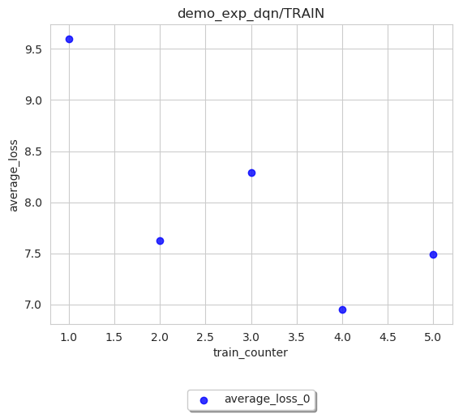

Logging and Visualization
==========================

(This page is under construction)
-------------------------------------

In this part, we will introduce how to record and save everything you want during an experiments. The contents are
organized as follows:

* How the logging module of Baconian works.
* How to modify your new implemented module so Baconian can capture the logging information you want to save.
* How to visualize with log file after experiment finished.

How the logging module of Baconian works
----------------------------------------

There are two important modules of Baconian: ``Logger`` and ``Recorder``, ``Recorder`` is coupled with every module or
class you want to record something during training or testing, for such as DQN, Agent or Environment. It will record the
information like loss, gradient or reward in a way that you specified. While ``Logger`` will take charge of these
recorded information, group them in a certain way and output them into file, console etc.

How to visualize with log file after experiment finished
--------------------------------------------------------------------------------

There are two files of data visualisation: ``log_data_loader`` and ``plotter``, ``log_data_loader`` loads
data from any ``log.json`` file produced in experiments. The user must assign the directory of the log file to plot,
such as ``demo_exp_agent`` or ``demo_exp_ddpg``. The data loader will create a pandas DataFrame (named ``data`` before
manipulation and ``data_new`` after manipulation ) to store ``index`` and ``key`` information,
and calculate ``MEAN`` and ``STD_DEV`` (only for multiple experiments). The manipulated DataFrame ``data_new``
will be passed to ``plotter`` to finish plotting work. Three plot modes: ``line``, ``scatter`` and ``histogram``
are available within ``plot_res`` function in ``log_data_loader``. ``plotter`` will use Matplotlib package to plot
a graph with ``data_new`` DataFrame as input.

Please refer to the following examples for single or multiple experiment visualisation:

- Single Experiment Visualisation

This example is to draw a ``line`` plot of ``average_reward`` in ``demo_exp_agent/TRAIN``
as a result of ``dyna`` experiment. Because there are too many records in the original
log. We use ``average_over`` to get the mean of each 10 of records, to produce a smooth
line plot. Finally, we save the figure as ``average_reward_VERSUS_sample_counter.pdf``.

.. code-block:: python

    image = loader.SingleExpLogDataLoader(path)
    image.plot_res(sub_log_dir_name='demo_exp_agent/TRAIN',
                   key="average_reward",
                   index='sample_counter',
                   mode='line',
                   save_format='pdf',
                   average_over=10,
                   )

.. image:: ./fig/average_reward_VERSUS_sample_counter.png

.. note::
     ``sub_log_dir_name`` should include the COMPLETE directory
     in between the ``log_path`` directory and ``json.log``.

Another example is to draw a ``scatter`` plot of ``average_loss`` in ``demo_exp_dqn/TRAIN`` for a DQN experiment.
We save the figure as ``average_loss_scatter.svg``.

.. code-block:: python

    image = loader.SingleExpLogDataLoader(path)
    image.plot_res(sub_log_dir_name='demo_exp_dqn/TRAIN',
                   key="average_loss",
                   index='train_counter',
                   mode='scatter',
                   save_format='svg',
                   file_name='average_loss_scatter',
                   )

Please note that ``histogram`` plot mode is a bit different from the other two modes, in terms of data manipulation.

.. code-block:: python

    image = loader.SingleExpLogDataLoader(path)
    image.plot_res(sub_log_dir_name='demo_exp_agent/TRAIN',
               key="average_reward",
               index='sample_counter',
               mode='histogram',
               file_name='average_reward_histogram'
               )

.. image:: ./fig/average_reward_histogram.png

.. note::
 ``MEAN`` or ``STD_DEV`` calculation is incompatible with ``histogram`` plot mode.

 Altough ``index`` is not shown in the histogram plot graph, in our Baconian project, it still must be specified by
 user, because ``log_data_loader`` file requires index to create a DataFrame. However, ``index`` can be any arbitrary
 argument in ``log.json`` without affecting the plotting graph.

- Multiple Experiment Visualisation

User can call ``MultipleExpLogDataLoader`` in ``log_data_loader`` to load multiple log files from a log path,
passing the experiment number as ``num`` argument.

This example is to draw a ``line`` plot of ``sum_reward`` in ``benchmark_agent/TEST``
as a result of 10 DDPG benchmark experiments.

.. code-block:: python

    image = loader.MultipleExpLogDataLoader(path, num=10)
    image.plot_res(sub_log_dir_name='benchmark_agent/TEST',
                   key="sum_reward",
                   index='sample_counter',
                   mode='line',
                   average_over=5,
                   )

.. image:: ./fig/sum_reward_VERSUS_sample_counter.png

In the same experiments, we draw a ``scatter`` plot of ``average_reward`` in ``benchmark_agent/TEST`` and save it as
``average_reward_benchmark.png``.

.. code-block:: python

    image = loader.MultipleExpLogDataLoader(path, num=10)
    image.plot_res(sub_log_dir_name='benchmark_agent/TEST',
                   key="average_reward",
                   index='sample_counter',
                   mode='line',
                   file_name='average_reward_benchmark',
                   average_over=5,
                   )

.. image:: ./fig/average_reward_benchmark.png

When plotting multiple experiment results in ``histogram`` mode, ``log_data_loader`` will load ``key`` into a single
column in the DataFrame ``data_new``. The histogram graph reflects the sum of all 10 experiments in each bin.

.. code-block:: python

    image = loader.MultipleExpLogDataLoader(path, num=10)
    image.plot_res(sub_log_dir_name='benchmark_ddpg/TRAIN',
                   key="average_critic_loss",
                   index='train',
                   mode='histogram',
                   file_name='average_critic_loss_benchmark',
                   )

.. image:: ./fig/average_critic_loss_benchmark.png