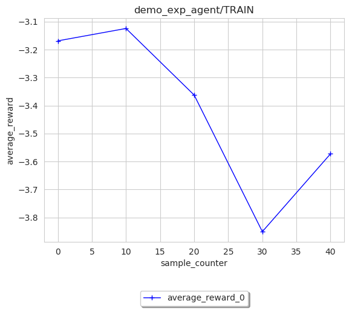
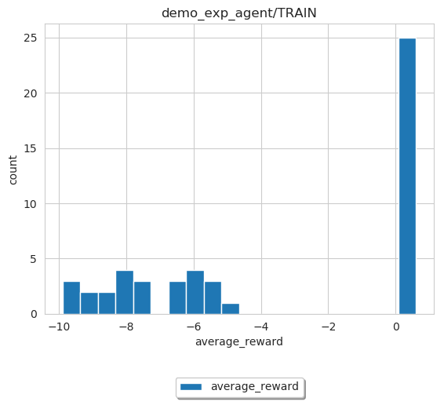
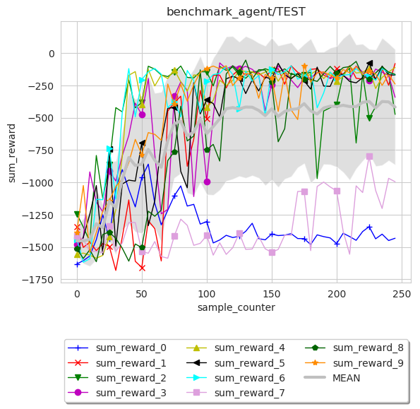
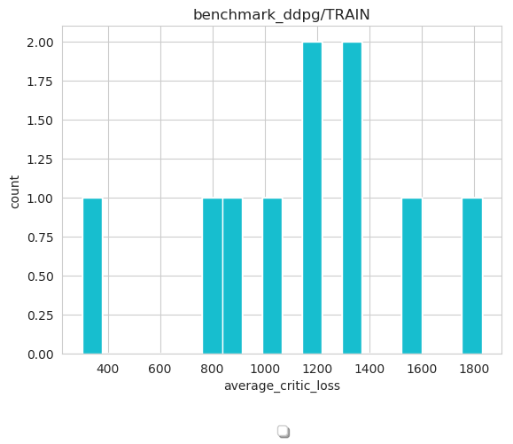

Logging and Visualization
==========================

In this part, we will introduce how to record and save everything you want during an experiments. The contents are
organized as follows:

* How to understand the log file after the experiment finished.
* How to visualize with log file after experiment finished.
* How the logging module of Baconian works.

Log Directory Explanation
----------------------
After one experiment finished, lots of built-in logging information will be recorded and saved to file so you can
visualize and analysis the results. A typical logging file directory looks like this:

.. code-block:: console

    .
     ├── console.log             # log output to console during experiments
     ├── final_status.json       # final status of all modules when the experiment finished
     ├── global_config.json      # config you use for this experiment include default config and customized config.
     ├── record                  # record folder contains all raw log of experiments.
     │   ├── agent               # agent level log (training samples' reward, test samples' reward etc.)
     │   │   ├── CREATED.json    # agent's log under CREATED status
     │   │   ├── INITED.json     # agent's log after CREATED and into INITED status
     │   │   ├── TRAIN.json      # agent's log under training status (e.g., reward received when sample for training, action during training sampling)
     │   │   └── TEST.json       # agent's log under test status (e.g., reward received when sample for evaluation/test)
     │   └── algo                # algorithm level log (loss, KL divergence, etc.)
     │   │   ├── CREATED.json    # algorithm's log under CREATED status
     │   │   ├── INITED.json     # algorithm's log after CREATED and into INITED status
     │   │   ├── TRAIN.json      # algorithm's log under training status (e.g., training loss)
     │   │   └── TEST.json       # algorithm's log under test status
     └── model_checkpoints       # store the checkpoints of tensorflow models if you have add the saving scheduler in your experiments.

Visualize and analyze the log
--------------------------------------------------------------------------------

Three plot modes: ``line``, ``scatter`` and ``histogram``
are available within ``plot_res`` function in ``log_data_loader``. ``plotter`` will use Matplotlib package to plot
a graph with ``data_new`` DataFrame as input. Users may utilise visualisation.py for fast plotting, with existing single or multiple experiment results.

Please refer to the following examples for single or multiple experiment visualisation:

- Single Experiment Visualisation

We use the log generated by running the :doc:`Dyna examples <./example/dyna>` as example.

Following code snippet is to draw a ``line`` plot of ``average_reward`` that agent received during training,
using data sampled from environment as index and averaged every 10 rewards for smooth line.

.. code-block:: python
    path = '/path/to/log/'
    image = loader.SingleExpLogDataLoader(exp_root_dir=path) # exp_root_dir is the path to the log folder generated after finish experiments
    image.plot_res(sub_log_dir_name='demo_exp_agent/TRAIN',
                   # Specify the log file to be used is from agent during training process,
                   # replace with demo_exp_agent/TRAIN can given the result during testing process.
                   key="average_reward",
                   # Value to plot is average reward. See the log.json under sub_log_dir_name for available keys,
                   index='sample_counter',
                   # Which key to use as index. See the log.json under sub_log_dir_name for available keys,
                   mode='line',
                   # Mode, choose from line, scatter and histogram
                   save_flag=True,
                   # Whether to save the figure
                   save_format='pdf',
                   # Format to save, support the Matplotlib built-in types, including JPG, PNG, PDF, EPS etc.
                   average_over=10,
                   # Average the results every 10 values.
                   )

.. note::
        ``sub_log_dir_name`` should include the COMPLETE directory
        in between the ``log_path`` directory and ``json.log``.
        For example, if you have a log folder structured as ``/path/to/log/record/demo_exp_agent/TEST/log.json``, then the ``sub_log_dir_name`` should be
        ``demo_exp_agent/TEST/`` and ``exp_root_dir`` should be ``/path/to/log/``.

Please note that ``histogram`` plot mode is a bit different from the other two modes, in terms of data manipulation. Although ``index`` is unnecessary under ``histogram`` mode, but currently user still should pass in one for internal data processing.

.. code-block:: python

    image = loader.SingleExpLogDataLoader(path)
    image.plot_res(sub_log_dir_name='demo_exp_agent/TRAIN',
               key="average_reward",
               index='sample_counter',
               mode='histogram',
               save_format='pdf',
               save_flag=True,
               file_name='average_reward_histogram'
               )

- Multiple Experiment Visualisation

Visualize the results from multiple runs can give a more reliable analysis of the RL methods, by plotting the mean and variance over these results.
Such can be done by ``MultipleExpLogDataLoader``

We use the DDPG benchmark experiments as example, use can found the script under the source code ``baconian-project/baconian/benchmark/run_benchmark.py``

Following code snippet is to draw a ``line`` plot of ``sum_reward`` in ``benchmark_agent/TEST``
as a result of 10 times of DDPG benchmark experiments.

.. code-block:: python

    path = '/path/to/log' # under the path, there should be 10 sub folders, each contains 1 experiment results.
    image = loader.MultipleExpLogDataLoader(path)
    image.plot_res(sub_log_dir_name='benchmark_agent/TEST',
                   key="sum_reward",
                   index='sample_counter',
                   mode='line',
                   save_flag=True,
                   average_over=10,
                   save_format='pdf'
                   )

We can see from the results that DDPG is not quite stable as 2 out of 10 runs failed to converge.

When plotting multiple experiment results in ``histogram`` mode, figure will reflect the histogram/data distribution using all experiments' data.

.. code-block:: python

    path = '/path/to/log'
    image = loader.MultipleExpLogDataLoader(path)
    image.plot_res(sub_log_dir_name='benchmark_ddpg/TRAIN',
                   key="average_critic_loss",
                   index='train',
                   mode='histogram',
                   file_name='average_critic_loss_benchmark',
                   save_format='pdf',
                   save_flag=True,
                   )

We can use the action distribution to analyze and diagnose algorithms.

How the logging module of Baconian works
----------------------------------------

There are two important modules of Baconian: ``Logger`` and ``Recorder``, ``Recorder`` is coupled with every module or
class you want to record something during training or testing, for such as DQN, Agent or Environment. It will record the
information like loss, gradient or reward in a way that you specified. While ``Logger`` will take charge of these
recorded information, group them in a certain way and output them into file, console etc.

